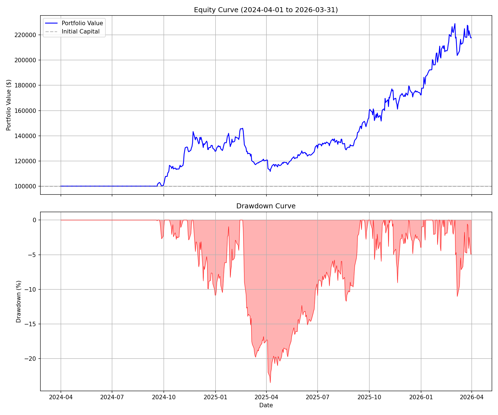
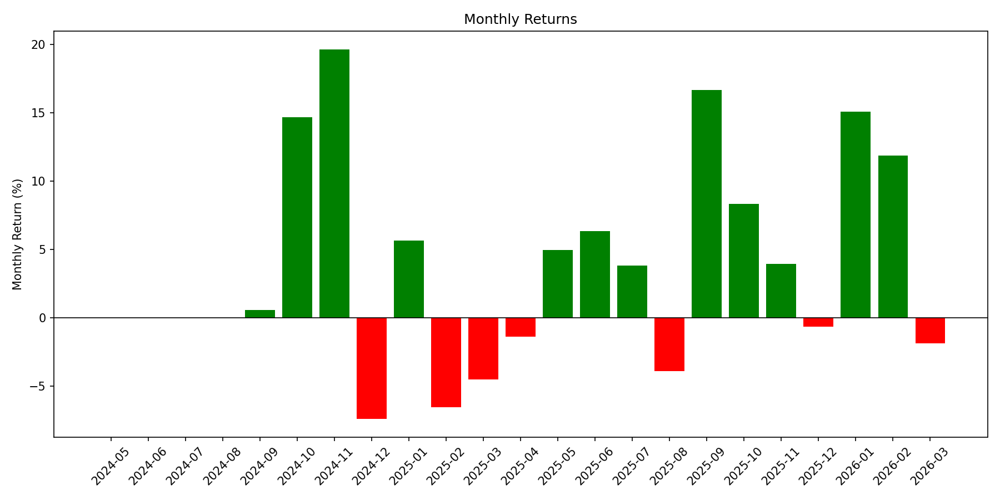

# 🦞 Quant-Trade 美股量化交易系统

基于 RPS（相对强度）的多因子选股与自动化交易系统，专为美股市场设计。支持历史回测、模拟盘交易、实盘交易，并提供完整的仓位管理与风控机制。

[English](./README.md) | [使用文档](./skills/quant-trade/SKILL-zh.md)

## ✨ 核心特性

- **RPS 选股**：基于 20/60/120 日相对强度排名，筛选强势股
- **多因子评分**：结合成交量因子、基本面因子（可选）
- **动态退出**：固定止损、移动止损、MACD 死叉、止盈、时间止损
- **仓位管理**：等权重仓位 + 总持仓上限 + 每日买入限制
- **回测引擎**：完整历史回测，支持绩效分析
- **实盘交易**：对接 Interactive Brokers API，支持模拟盘与实盘
- **数据管理**：本地 SQLite 数据库，支持全量下载与每日增量更新

## 📊 回测表现（2024-04-01 至 2026-03-31）

| 指标 | 数值 |
|------|------|
| 初始资金 | $100,000 |
| 最终资金 | $203,900 |
| 总收益率 | **103.90%** |
| 年化收益率 | **41.05%** |
| 夏普比率 | **1.67** |
| 最大回撤 | -20.55% |
| 胜率 | 48.75% |
| 平均盈利 | +10.64% |
| 平均亏损 | -6.08% |

### 资产曲线



### 月度收益



### 交易记录

[下载交易记录 CSV](assets/trades.csv)

## 📁 目录结构

```
quant-trade/
├── README.md
├── README-zh.md
├── LICENSE
├── requirements.txt
├── assets/                       # 图片资源
│   ├── equity_curve.png
│   └── monthly_returns.png
├── data/                         # 数据存储
│   └── quant_trade/
│       ├── db/
│       │   └── market_data.db
│       ├── logs/
│       ├── cache/
│       └── backtest/
├── tests/                        # 测试脚本
│   ├── test_all.py
│   ├── test_ibapi.py
│   └── test_ibsync.py
└── skills/
    └── quant-trade/
        ├── SKILL.md
        ├── SKILL-zh.md
        ├── config.yaml
        ├── config.example.yaml
        ├── hooks/
        ├── references/
        └── scripts/
            ├── main.py
            ├── core/
            │   ├── config.py
            │   ├── data_manager.py
            │   ├── stock_pool.py
            │   ├── rps_calculator.py
            │   └── factors.py
            ├── trading/
            │   ├── ibkr_client.py
            │   ├── risk_checker.py
            │   └── stop_loss_monitor.py
            ├── analysis/
            │   ├── screener.py
            │   ├── backtest.py
            │   ├── generate_report.py
            │   └── optimize.py
            └── utils/
                ├── update_fundamentals.py
                └── update_fundamentals_history.py
```

## 🚀 快速开始

### 1. 环境准备

```bash
# 克隆项目
git clone https://github.com/yourname/quant-trade.git
cd quant-trade

# 创建 conda 环境
conda create -n openclaw python=3.10 -y
conda activate openclaw

# 安装依赖
pip install -r requirements.txt
```

### 2. 配置

编辑 `skills/quant-trade/config.yaml`：

```yaml
# 风险参数
risk:
  stop_loss_pct: -10
  take_profit_pct: 30
  trailing_stop_pct: 10
  max_hold_days: 25
  min_hold_days: 3
  use_macd_sell: false

# 选股参数
screener:
  rps_threshold: 85
  rps_periods: [20, 60, 120]
  max_buy: 3          # 每日最多买入数量
  max_own: 5          # 总持仓上限
  use_fundamentals: false

# IBKR 连接
ibkr:
  host: "127.0.0.1"
  port: 7497          # 模拟盘端口
  client_id: 1
  timeout: 30

# 数据源
data_source: "yfinance"
commission: 0.001     # 手续费率 0.1%
```

### 3. 下载历史数据

```bash
cd skills/quant-trade/scripts
python main.py --step update
```

### 4. 运行回测

```bash
python main.py --step backtest
```

### 5. 模拟盘交易

1. 启动 IBKR TWS/IB Gateway，登录模拟账户
2. 运行交易：

```bash
# 模拟模式（不实际下单）
python main.py --step trade --dry-run

# 真实模拟交易
python main.py --step trade
```

### 6. 每日自动化

设置 cron 定时任务（美股收盘后运行）：

```bash
crontab -e
# 添加以下行（周一至周五 04:30 运行）
30 4 * * 1-5 cd /path/to/quant-trade/skills/quant-trade/scripts && conda activate openclaw && python main.py --step all >> logs/daily.log 2>&1
```

## 📖 命令说明

| 命令 | 说明 |
|------|------|
| `python main.py --step all` | 完整流程（更新数据+选股+交易+监控） |
| `python main.py --step update` | 仅更新数据 |
| `python main.py --step screen` | 仅运行选股 |
| `python main.py --step trade` | 仅执行交易 |
| `python main.py --step monitor` | 仅运行止损监控 |
| `python main.py --step backtest` | 运行回测 |
| `--dry-run` | 模拟模式，不实际下单 |
| `--force-refresh` | 强制刷新数据 |

## 🔧 仓位管理逻辑

- **目标持仓**：每只股票目标市值 = 账户总资产 / `max_own`
- **每日买入**：最多买入 `max_buy` 只新股票（未持仓）
- **资金分配**：现金不足时，按比例分配
- **卖出机制**：触发止损/止盈/时间止损/MACD 死叉时自动卖出

## 📈 回测报告

运行回测后，系统会输出：
- 总收益率、年化收益率、夏普比率
- 最大回撤、胜率、平均盈亏
- 月度收益表
- 资产曲线图、回撤曲线图

## ⚠️ 注意事项

1. **模拟盘优先**：首次使用请务必用模拟盘测试，确认逻辑无误
2. **数据质量**：yfinance 为免费数据源，可能存在延迟或缺失
3. **风险控制**：回测结果不代表未来表现，实盘请控制仓位
4. **网络要求**：每日更新需要网络连接，定时任务请确保环境稳定

## 📚 依赖

- Python 3.10+
- pandas, numpy, requests, yfinance
- ib_insync (IBKR API)
- pandas_ta (技术指标)
- matplotlib (图表)
- tqdm (进度条)

## 🤝 贡献

欢迎提交 Issue 和 Pull Request。

## 📄 许可证

MIT License

## 🎯 下一步计划

- [ ] 支持 A股/港股市场
- [ ] 增加更多技术指标因子
- [ ] 机器学习选股模型
- [ ] Web 可视化面板

